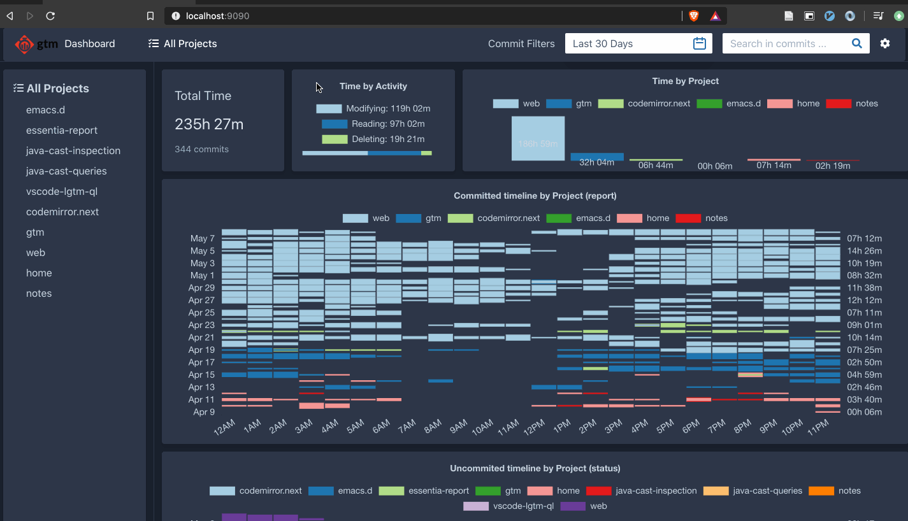
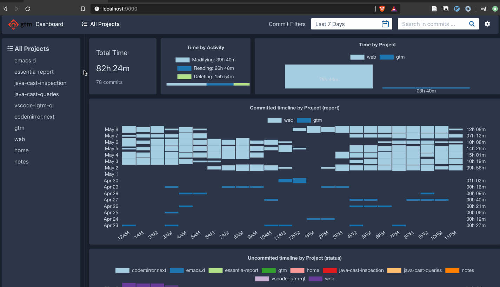
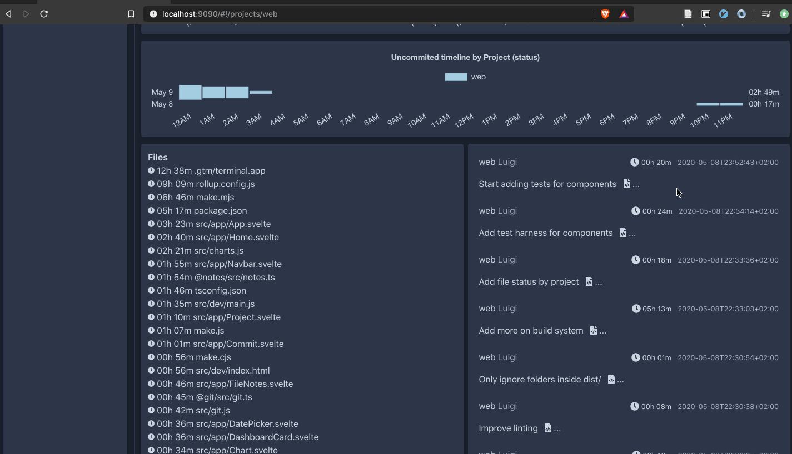

# Git Time Metric Dashboard

Reporting application to visualize [Git Time Metric](https://github.com/git-time-metric/gtm) time data.

Git Time Metric is an application that lets you track the time you spend working on files in your git repositories.
To store your time data, it uses [git notes](https://git-scm.com/docs/git-notes), which is essentially metadata stored in your git repository.

Git Time Metric Dashboard is an application to visualize your time data.
Keep in mind that this is heavily **work in progress**. Feel free to open issues or pull requests if you would like to add any feature,
or you have early feedback.

## Installation

To work with **gtm Dashboard** you will need **gtm** to track your time.
First, install [Git Time Metric](https://github.com/git-time-metric/gtm) and any of its [plugins](https://github.com/git-time-metric/gtm#install-a-plugin-for-your-editor) and automatically start tracking your time.
Then you can install **gtm Dashboard**.
Go to [releases](https://github.com/acuarica/gtm-web/releases) and download gtm Dashboard for your operating system.
It will automatically detect your gtm installation, and you can visualize you time data.

## Features

- Filter by date and git message contents
- Visualize your time data per project or all together
- Integrated timeline on what projects you spend most of your time
- Report time spent in each commit
- Report time spent in each file

## Demo

gtm Dashboard works offline.
Once installed, it reads your time data generated from gtm.
However, since it is made using web technologies, you can see gtm Dashboard in action:

[https://acuarica.github.io/gtm-web/](https://acuarica.github.io/gtm-web/)

## Previews

### Home page

Shows a dashboard of your **gtm** data.
The sidebar includes all projects registered with **gtm**.

### Filter projects by date

You can filter commits by selecting a specific date or period in the navigation bar.
You can filter by messages using the search box.

### Project view

The project view shows your **gtm** data focused in a given project.

### Project's commit view

The project view includes files and commits in the given range.
You can visualize time spent in each commit and in each file.

